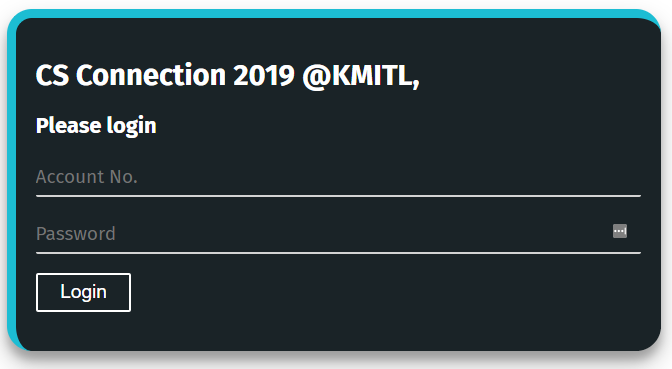

# MVC_KMITL62 :closed_book:

## Simple [MVC](https://en.wikipedia.org/wiki/Model%E2%80%93view%E2%80%93controller) practice [AF](https://www.urbandictionary.com/define.php?term=As%20fuck) using angular 8

ตัวอย่างแนวทางจาก https://scotch.io/tutorials/mvc-in-an-angular-world

UI ใช้ Primeng(primeface) + Custom CSS

Angular ใช้หลักการแบบ MVVM/MVVC/MVW(Model View WhatEver) ไม่ใช้ MVC

แต่ตัวอย่างนี้ใช้ Angular สำหรับช่วยในส่วนของ View ให้ง่ายขึ้น โครงสร้างการทำงานจะเป็นไปตามหลัก MVC ด้วยพื้นฐานของ JS/TS

**ไม่ควรนำไปใช้ในการทำโปรเจค Angular ในงานจริง**

## How to (For noob) :see_no_evil:
Install Node.Js

Run คำสั่ง `npm install` ติดตั้ง package

Run คำสั่ง `npm start` และเปิด Firefox ~~cuz firefox is da best~~ เข้าไปที่ localhost:4200

## Files :file_folder:
หลักๆ อยู่ที่ src/app/student 
- ***student.model.ts*** => ใส่ทุก Function ในนี้
- ***student.view.html*** => สำหรับแสดงผล (สิ่งที่มองเห็น)
- ***student.controller.ts*** => เปลี่ยนค่าที่แสดง, เรียก Fuction จากใน Model

> This project was generated with [Angular CLI](https://github.com/angular/angular-cli) version 8.3.9. 